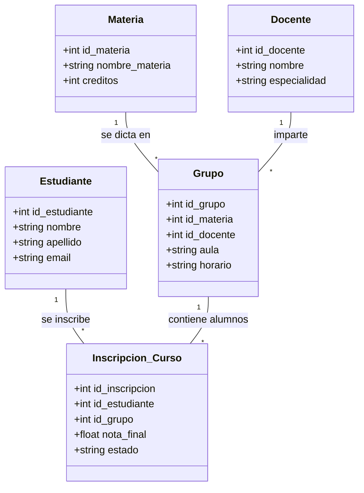

<div align="center">

# TALLER PRÁCTICO MVC + DAO + SERVICE + DB (POSTGRESQL) + JAVA SWING

**Integrantes**  
Jean Paul Rojas Herrera  
Michael Dowglas Lenis Chaguendo

**Docente**  
Gabriel Perez Moreno

</div>

## Tabla de contenidos

1. [Objetivo](#objetivo)
2. [Diagrama de clases del ecosistema](#diagrama-de-clases-del-ecosistema)
3. [Configuración de la base de datos](#configuración-de-la-base-de-datos)  
    3.1. [Crear el esquema y las tablas](#crear-el-esquema-y-las-tablas)  
    3.2. [Crear el usuario administrador inicial](#crear-el-usuario-administrador-inicial)
4. [Configuración del archivo config.properties](#configuración-del-archivo-configproperties)  
    4.1. [Ejemplo con Neon](#ejemplo-con-neon)  
    4.2. [Ejemplo con PostgreSQL local](#ejemplo-con-postgresql-local)
5. [Estructura del proyecto](#estructura-del-proyecto)
6. [Instrucciones de uso](#instrucciones-de-uso)

## Objetivo

Replicar el ecosistema académico propuesto en el diagrama Mermaid, siguiendo los estándares de arquitectura en capas (Entidad, DAO, Service, Controller, Vista).

## Diagrama de clases del ecosistema



## Configuración de la base de datos

- ### Crear el esquema y las tablas

Ejecuta el siguiente script SQL completo en tu base de datos PostgreSQL. Puedes hacerlo desde el SQL Editor de Neon Console, pgAdmin, o cualquier cliente compatible.

```sql
-- ============================================================
-- ESQUEMA
-- ============================================================

CREATE SCHEMA IF NOT EXISTS "practica-mvc";

-- ============================================================
-- TABLAS
-- ============================================================

CREATE TABLE "practica-mvc".docente (
    id_docente   SERIAL PRIMARY KEY,
    nombre       VARCHAR(100) NOT NULL,
    especialidad VARCHAR(100) NOT NULL
);

CREATE TABLE "practica-mvc".estudiante (
    id_estudiante SERIAL PRIMARY KEY,
    nombre        VARCHAR(100) NOT NULL,
    apellido      VARCHAR(100) NOT NULL,
    email         VARCHAR(150) NOT NULL
);

CREATE TABLE "practica-mvc".materia (
    id_materia     SERIAL PRIMARY KEY,
    nombre_materia VARCHAR(150) NOT NULL,
    creditos       INTEGER      NOT NULL
);

CREATE TABLE "practica-mvc".grupo (
    id_grupo   SERIAL PRIMARY KEY,
    id_materia INTEGER      NOT NULL,
    id_docente INTEGER      NOT NULL,
    aula       VARCHAR(50)  NOT NULL,
    horario    VARCHAR(100) NOT NULL,
    CONSTRAINT fk_grupo_materia FOREIGN KEY (id_materia) REFERENCES "practica-mvc".materia(id_materia),
    CONSTRAINT fk_grupo_docente FOREIGN KEY (id_docente) REFERENCES "practica-mvc".docente(id_docente)
);

CREATE TABLE "practica-mvc".inscripcion_curso (
    id_inscripcion SERIAL PRIMARY KEY,
    id_estudiante  INTEGER       NOT NULL,
    id_grupo       INTEGER       NOT NULL,
    nota_final     NUMERIC(3, 1),          -- nullable: se asigna después de cursar
    estado         VARCHAR(50)   NOT NULL,
    CONSTRAINT fk_inscripcion_estudiante FOREIGN KEY (id_estudiante) REFERENCES "practica-mvc".estudiante(id_estudiante),
    CONSTRAINT fk_inscripcion_grupo      FOREIGN KEY (id_grupo)      REFERENCES "practica-mvc".grupo(id_grupo)
);

CREATE TABLE "practica-mvc".usuario (
    id_usuario SERIAL PRIMARY KEY,
    username   VARCHAR(50) NOT NULL UNIQUE,
    password   VARCHAR(50) NOT NULL,
    rol        VARCHAR(20) NOT NULL,
    CONSTRAINT usuario_rol_check CHECK (rol IN ('Administrador', 'Usuario'))
);

CREATE TABLE "practica-mvc".auditoria (
    id_auditoria SERIAL PRIMARY KEY,
    usuario      VARCHAR(50) NOT NULL,
    accion       VARCHAR(20) NOT NULL,
    entidad      VARCHAR(50) NOT NULL,
    descripcion  TEXT        NOT NULL,
    fecha_hora   TIMESTAMPTZ NOT NULL DEFAULT now(),
    CONSTRAINT auditoria_accion_check CHECK (accion IN ('CREAR', 'ACTUALIZAR', 'ELIMINAR'))
);
```

> [!NOTE]
> En cuanto a `fecha_hora`, la columna usa `TIMESTAMPTZ` (timestamp with time zone) para que PostgreSQL almacene el instante exacto en UTC. La aplicación convierte automáticamente ese valor a la zona horaria local de la máquina donde se ejecuta, por lo que la hora que ves en el historial de actividad siempre corresponde a tu hora local.

- ### Crear el usuario administrador inicial

Antes de iniciar sesión por primera vez necesitas al menos un usuario con rol `Administrador`:

```sql
INSERT INTO "practica-mvc".usuario (username, password, rol)
VALUES ('admin', 'admin123', 'Administrador');
```

Puedes cambiar `username` y `password` por los valores que prefieras. Una vez dentro del programa puedes crear más usuarios desde **Configuración → Gestión de usuarios**.

## Configuración del archivo `config.properties`

El proyecto lee la conexión a la base de datos desde un archivo llamado `config.properties` ubicado en la **raíz del proyecto** (al mismo nivel que `pom.xml`). Este archivo **no se incluye en el repositorio** para proteger las credenciales.

Crea el archivo manualmente con el siguiente contenido y rellena los valores según tu proveedor:

```properties
# URL de conexión JDBC a PostgreSQL
db.url = jdbc:postgresql://<host>:<puerto>/<nombre-base-de-datos>

# Usuario de la base de datos
db.user = <tu-usuario>

# Contraseña de la base de datos
db.password = <tu-contraseña>
```

- ### Ejemplo con Neon

Si usas [Neon](https://neon.tech), la cadena de conexión la encuentras en tu proyecto bajo **Dashboard → Connection Details → Java**:

```properties
# POSTGRESQL - Servidor remoto Neon

db.url = jdbc:postgresql://ep-xxxx-xxxx-pooler.c-6.us-east-1.aws.neon.tech:5432/neondb
db.user = neondb_owner
db.password = xxxxxxxxxxxxxxxxxxxx
```

> [!NOTE]
> Neon usa connection pooling por defecto. Asegúrate de copiar la URL del pooler (contiene `-pooler` en el host) para evitar errores de conexión bajo carga.

- ### Ejemplo con PostgreSQL local

```properties
# POSTGRESQL - Servidor local

db.url = jdbc:postgresql://localhost:5432/practica_mvc
db.user = postgres
db.password = tu_contraseña_local
```

> [!IMPORTANT]
> Asegúrate de que el esquema `practica-mvc` existe en la base de datos que apuntas y que el usuario tiene permisos de lectura y escritura sobre él.

## Estructura del proyecto

```
src/
├── main/
│   └── java/com/mvc/
│       ├── config/                                # Configuración general y conexión a la base de datos
│       │   ├── ConexionPostgreSQLDatabase.java    # Manejo de la conexión JDBC con PostgreSQL
│       │   └── ConfiguracionApp.java              # Carga de propiedades y configuración global
│       ├── controllers/                           # Controladores (comunican vistas con servicios)
│       │   ├── ControladorDocente.java
│       │   ├── ControladorEstudiante.java
│       │   ├── ControladorGrupo.java
│       │   ├── ControladorInscripcionCurso.java
│       │   ├── ControladorLogin.java
│       │   └── ControladorMateria.java
│       ├── dao/                                   # Capa de acceso a datos (CRUD con JDBC)
│       │   ├── AuditoriaDao.java
│       │   ├── DocenteDao.java
│       │   ├── EstudianteDao.java
│       │   ├── GrupoDao.java
│       │   ├── InscripcionCursoDao.java
│       │   ├── MateriaDao.java
│       │   └── UsuarioDao.java
│       ├── models/                                # Entidades del dominio (representan tablas de la BD)
│       │   ├── Auditoria.java
│       │   ├── Docente.java
│       │   ├── Estudiante.java
│       │   ├── Grupo.java
│       │   ├── InscripcionCurso.java
│       │   ├── Materia.java
│       │   └── Usuario.java
│       ├── services/                              # Lógica de negocio del sistema
│       │   ├── AuditoriaService.java
│       │   ├── DocenteService.java
│       │   ├── EstudianteService.java
│       │   ├── ExportadorService.java             # Exportación de datos (reportes)
│       │   ├── GrupoService.java
│       │   ├── InscripcionCursoService.java
│       │   ├── MateriaService.java
│       │   └── UsuarioService.java
│       ├── views/                                 # Interfaz gráfica desarrollada con Java Swing
│       │   ├── DialogConfiguracion.java
│       │   ├── PanelEstadisticas.java
│       │   ├── VistaDocenteSwing.java
│       │   ├── VistaEstudianteSwing.java
│       │   ├── VistaGrupoSwing.java
│       │   ├── VistaInscripcionCursoSwing.java
│       │   ├── VistaLoginSwing.java
│       │   ├── VistaMateriaSwing.java
│       │   └── VistaPrincipalSwing.java
│       └── Main.java                              # Punto de entrada de la aplicación
│
└── test/
    └── java/com/mvc/                              # Pruebas unitarias de servicios
        ├── views/
        │   └── VistaPrincipalSwingTest.java       # Prueba de la vista principal
        ├── DocenteServiceTest.java
        ├── EstudianteServiceTest.java
        ├── GrupoServiceTest.java
        ├── InscripcionCursoServiceTest.java
        └── MateriaServiceTest.java

target/               # Directorio generado automáticamente por Maven (compilación y build)
.gitignore            # Archivos y carpetas excluidos del control de versiones
config.properties     # Configuración de la base de datos
pom.xml               # Definición del proyecto y dependencias
README.md             # Documentación del proyecto
```

> [!IMPORTANT]
> `config.properties` no está incluido en el repositorio. Debes crearlo manualmente en la raíz del proyecto siguiendo las instrucciones de la [sección anterior](#configuración-del-archivo-configproperties).

> [!NOTE]
> `target/` es generado automáticamente por Maven al compilar. No es necesario crearlo ni modificarlo manualmente.

## Instrucciones de uso

1. Abrir Visual Studio Code.
2. Situarse en **View** y seleccionar **Source Control** en la barra lateral izquierda.
3. Presionar la opción **Clone Repository**.
4. Pegar la URL del repositorio donde se encuentra el trabajo.
5. Elegir una carpeta del computador donde se guardará el proyecto.
6. Cuando Visual Studio Code pregunte si se desea abrir el repositorio clonado, seleccionar **Open**.
7. Crear el archivo `config.properties` en la raíz del proyecto con las credenciales de tu base de datos.
8. Abrir una terminal en VS Code (`Ctrl+ñ`) y ejecutar `mvn clean compile` para descargar las dependencias del proyecto.
9. Abrir el archivo `Main.java`.
10. Presionar el botón **Run** que aparece sobre el método `main`, o usar la opción **Run Java** si está instalada la extensión de Java.